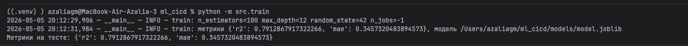
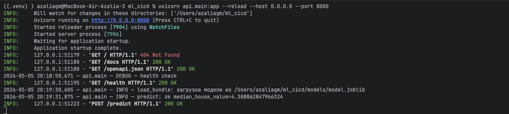
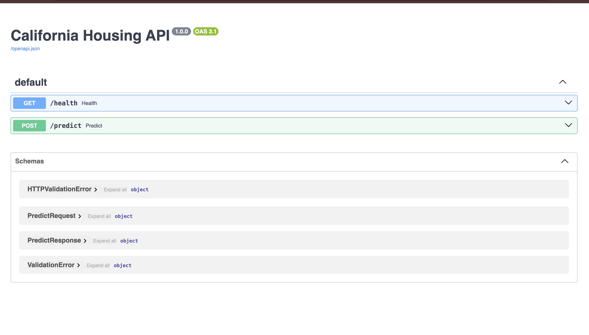
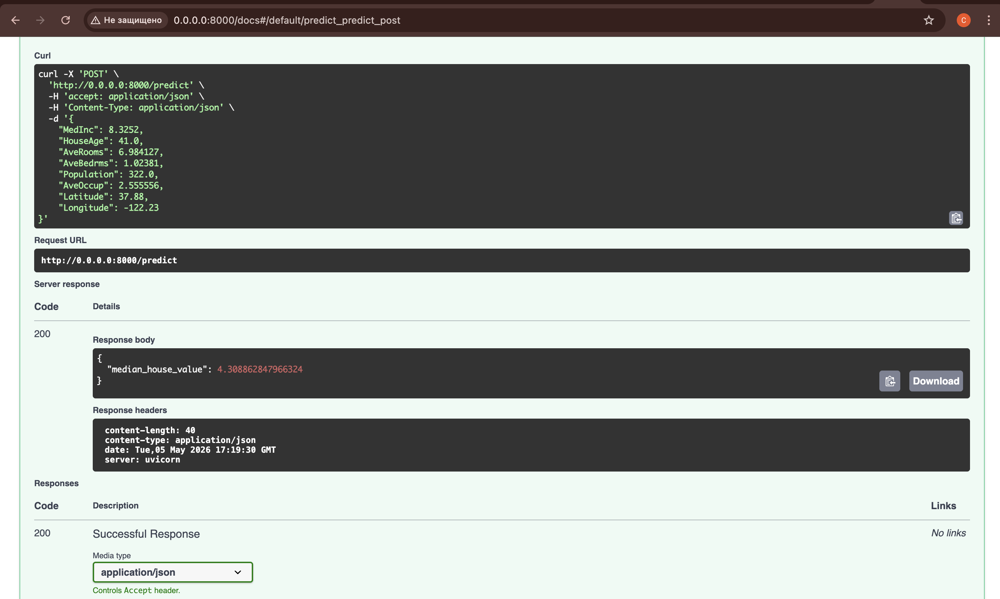
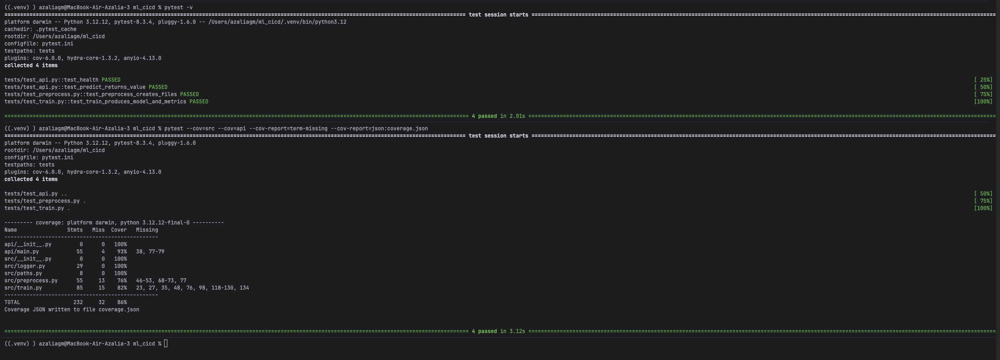
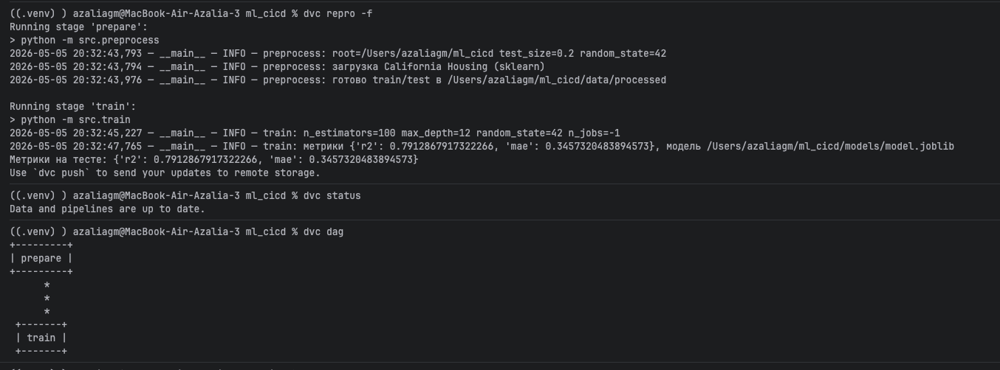
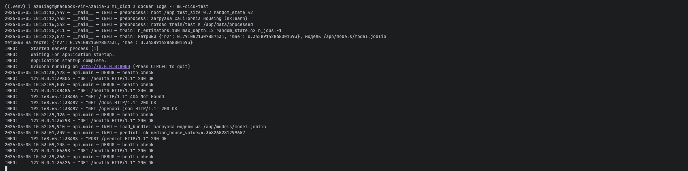
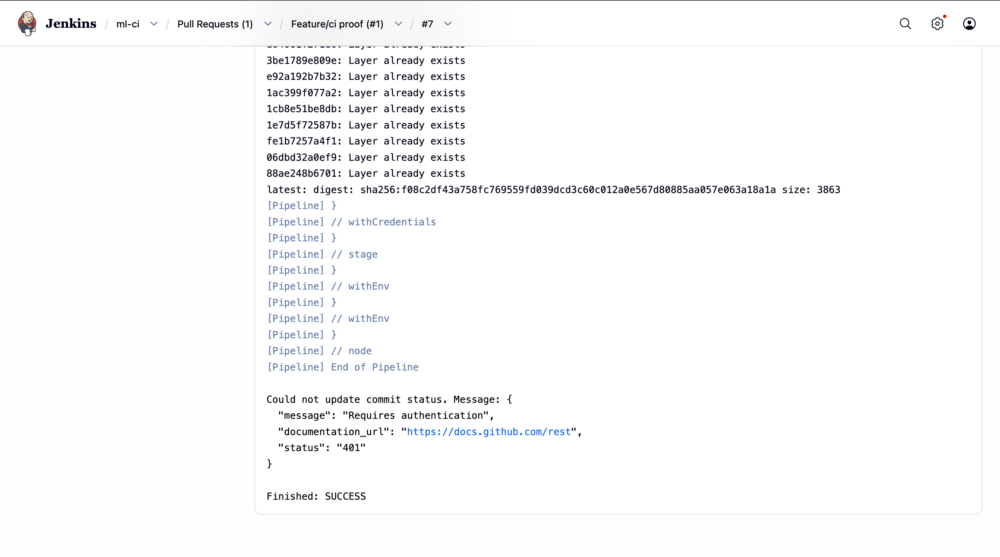
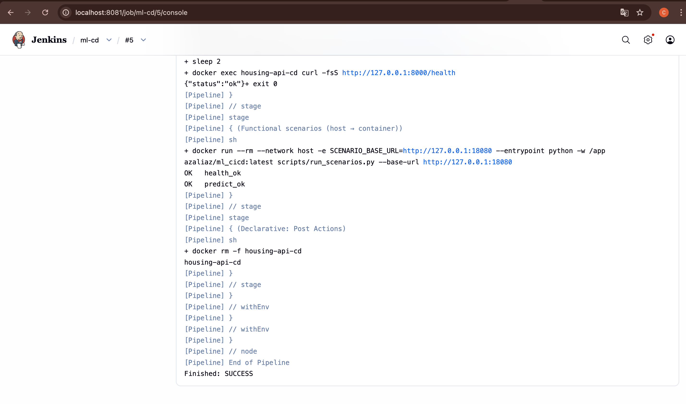

# Лабораторная №1
## Введение

В данной работе реализован полный жизненный цикл ML-проекта:
1. подготовка данных;
2. обучение классической модели;
3. перенос логики из notebook в production-скрипты;
4. REST API для инференса;
5. покрытие тестами;
6. оформление ML-пайплайна в DVC;
7. контейнеризация в Docker;
8. подготовка конфигурационных файлов;
9. CI pipeline в Jenkins;
10. CD pipeline в Jenkins;
11. фиксация и приложение результатов функционального тестирования.

Проект выполнен на датасете California Housing (задача регрессии).

---

## Что за модель и что она предсказывает

### Предметная область

Используется датасет California Housing из `sklearn.datasets`.
Целевая переменная: `MedHouseVal` (медианная стоимость жилья в районе, в условных единицах по 100k USD).

### Признаки модели

Модель использует 8 числовых признаков:
- `MedInc` - медианный доход жителей в районе (группе домов, block group)
- `HouseAge` - медианный возраст домов в районе (в годах)
- `AveRooms` - среднее число комнат на домохозяйство в районе
- `AveBedrms` - среднее число спален на домохозяйство в районе
- `Population` - численность населения в районе
- `AveOccup` -  среднее число жителей на домохозяйство (средняя “заселенность”)
- `Latitude` - географическая широта района
- `Longitude` - географическая долгота района

### Алгоритм

Алгоритм: `RandomForestRegressor` (классический алгоритм регрессии).

Почему выбран:
- хорошо работает на табличных данных;
- устойчив к нелинейным зависимостям;
- не требует сложного масштабирования;
- интерпретируем по важности признаков.

Гиперпараметры задаются в `config.ini`.

---

## Архитектура проекта

Ключевые файлы и назначение:

- `src/preprocess.py` - подготовка данных и split;
- `src/train.py` - обучение модели и сохранение артефакта;
- `api/main.py` - FastAPI-сервис для предсказаний;
- `tests/` - unit/API тесты;
- `dvc.yaml`, `dvc.lock`, `.dvc/config` - DVC-пайплайн;
- `Dockerfile`, `docker-compose.yml`, `docker/entrypoint.sh` - контейнеризация;
- `CI/Jenkinsfile` - CI (build + tests + push);
- `CD/Jenkinsfile` - CD (run + health + functional scenarios);
- `scenario.json` - функциональные сценарии API;
- `scripts/run_scenarios.py` - раннер сценариев;
- `scripts/update_dev_sec_ops.py` - обновление `dev_sec_ops.yml`;
- `dev_sec_ops.yml` - агрегированные DevSecOps-метаданные.

---

## 1) Установка
```
python3 -m venv .venv
source .venv/bin/activate  
pip install -r requirements.txt
```

## 2) Подготовка данных

### Что сделано

Реализован скрипт `src/preprocess.py`, который:
- загружает California Housing;
- сохраняет raw-датасет;
- выполняет `train_test_split`;
- сохраняет подготовленные данные в `data/processed`.

Параметры split задаются в `params.yaml`.

### Команды запуска

```bash
python -m src.preprocess
```

### Результат

Создаются:
- `data/raw/california_housing.csv`
- `data/processed/X_train.csv`
- `data/processed/X_test.csv`
- `data/processed/y_train.csv`
- `data/processed/y_test.csv`


## 3) Разработка ML-модели

Реализован `src/train.py`:
- читает подготовленные данные;
- создает `RandomForestRegressor`;
- обучает модель;
- вычисляет метрики (`R2`, `MAE`);
- сохраняет модель в `models/model.joblib`.

### Команды запуска

```bash
python -m src.train
```

### Ожидаемый результат

- файл `models/model.joblib`;
- вывод метрик в консоль и в логи.


## 4) API

- API-сервис: `api/main.py`.

Реализованы endpoints:
- `GET /health` - проверка готовности сервиса;
- `POST /predict` - получение предсказания.

### Запуск API

```bash
uvicorn api.main:app --reload --host 0.0.0.0 --port 8000
```

Проверка:
```bash
curl http://127.0.0.1:8000/health
```

Пример `predict`:
```bash
curl -X POST "http://127.0.0.1:8000/predict" \
  -H "Content-Type: application/json" \
  -d '{
    "MedInc": 8.3252,
    "HouseAge": 41.0,
    "AveRooms": 6.984127,
    "AveBedrms": 1.02381,
    "Population": 322.0,
    "AveOccup": 2.555556,
    "Latitude": 37.88,
    "Longitude": -122.23
  }'
```


После запуска FastAPI-приложения можно проверить OpenAPI (Swagger UI) по адресу http://127.0.0.1:8000/docs




## 5) Тесты

### Что сделано

Использован `pytest`:
- `tests/test_preprocess.py`
- `tests/test_train.py`
- `tests/test_api.py`

Использован `pytest-cov` для покрытия.

### Команды запуска

```bash
pytest -v
pytest --cov=src --cov=api --cov-report=term-missing --cov-report=json:coverage.json
```

### Результат

- успешные тесты;
- файл `coverage.json` с покрытием.




## 6) DVC

### Что сделано

Настроен DVC-пайплайн в `dvc.yaml`:
- stage `prepare` -> preprocess;
- stage `train` -> обучение модели.

Состояние пайплайна фиксируется в `dvc.lock`.

### Команды запуска

```bash
dvc repro
dvc status
dvc dag
```


## 7) Docker

### Что сделано

- `Dockerfile` собирает образ с зависимостями и кодом;
- `docker/entrypoint.sh` выполняет preprocessing + training + запуск API;
- `docker-compose.yml`  локальный запуск.

### Сборка и запуск

```bash
docker build -t azaliaz/ml_cicd:latest .
docker run --rm -p 8000:8000 azaliaz/ml_cicd:latest
```

## 8) Конфигурационные файлы дистрибутива

- `config.ini`  
  Гиперпараметры модели (n_estimators, max_depth, random_state, n_jobs).

- `Dockerfile` / `docker-compose.yml`  
  Конфигурация образа и запуска контейнера API.

- `requirements.txt`  
  Список библиотек с зафиксированными версиями.

- `dev_sec_ops.yml`  
  Метаданные DevSecOps:
  - digest docker-образа;
  - последние 5 commit hash;
  - покрытие тестами.

- `scenario.json`  
  Описание функциональных сценариев для работающего контейнера API.

### Обновление `dev_sec_ops.yml`

```bash
python scripts/update_dev_sec_ops.py
docker inspect --format='{{index .RepoDigests 0}}' azaliaz/ml_cicd:latest
```

Полученный digest подставляется в `dev_sec_ops.yml`.

---

## 9) CI pipeline: сборка и push в DockerHub по PR в `main`

### Что реализовано

`CI/Jenkinsfile` выполняет:
1. checkout кода;
2. `docker build`;
3. `pytest` внутри контейнера;
4. `docker push` в DockerHub.

Push выполняется для PR в `main`.



## 10) CD pipeline: запуск контейнера и функциональное тестирование

### Что реализовано

`CD/Jenkinsfile` выполняет:
1. `docker pull` образа;
2. `pytest` внутри образа (опционально);
3. запуск контейнера API;
4. ожидание готовности через health-check;
5. запуск функциональных сценариев из `scenario.json`;
6. очистку временного контейнера.


### Параметры запуска CD

- `DOCKER_IMAGE` (например, `azaliaz/ml_cicd:latest`);
- `HOST_PORT` (например, `18080`);
- `RUN_PYTEST_IN_CONTAINER=true`;
- `RUN_SCENARIOS=true`.

### Как запускать

В Jenkins: `ml-cd -> Build with Parameters`.


